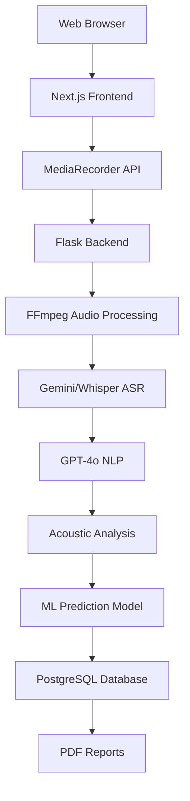

# Cá Vàng – Thắp Sáng Ký Ức
## Hệ thống AI đa phương thức phân tích giọng nói để sàng lọc sa sút trí tuệ tại nhà

### Abstract
Sa sút trí tuệ ảnh hưởng lớn đến cộng đồng người cao tuổi Việt Nam nhưng tỷ lệ chẩn đoán rất thấp. Dự án trình bày một hệ thống AI đa phương thức (giọng nói + ngôn ngữ + âm học) cho sàng lọc nhận thức tại nhà, dự đoán điểm MMSE. Hệ thống gồm frontend Next.js, backend Flask với pipeline AI (ASR, NLP, acoustic), CSDL PostgreSQL. Các đánh giá bao gồm hiệu năng ASR (WER), độ chính xác dự đoán MMSE (MAE, r, R²), thời gian xử lý, cùng khung xác thực lâm sàng (sensitivity/specificity). Hệ thống nhấn mạnh tối ưu tiếng Việt, bảo mật AES-256-GCM và khả năng mở rộng bền vững.

Keywords: dementia screening, MMSE, Vietnamese ASR, multimodal AI, acoustic features, NLP, Flask, Next.js, PostgreSQL, AES-256-GCM

---

## PHẦN 1: TRANG BÌA
Tên dự án: "Cá Vàng – Thắp Sáng Ký Ức"
Subtitle: "Hệ thống AI đa phương thức phân tích giọng nói để sàng lọc sa sút trí tuệ tại nhà"

Đội thi: [TÊN ĐỘI]
Thành viên:
- Đình Púc (Kỹ thuật - AI/Backend)
- Lan Phy (Thiết kế & Khảo sát - UI/UX)

Trường: [TÊN TRƯỜNG]
Khu vực: [KHU VỰC THI]
Giáo viên hướng dẫn: Trần Đức Thanh

---

## PHẦN 2: TÓM TẮT DỰ ÁN (Executive Summary)
- Vấn đề: 10% người >60 tuổi có suy giảm nhận thức; tại Việt Nam ước tính ~500.000 ca Alzheimer nhưng chỉ ~1% được chẩn đoán.
- Giải pháp: Web app thu giọng nói, chuyển thành văn bản (ASR), phân tích ngôn ngữ + âm học và dự đoán điểm MMSE theo thang 30.
- Công nghệ cốt lõi: Gemini ASR (VN-optimized), GPT-4o NLP, Librosa acoustic features, scikit-learn/XGBoost cho dự đoán, Flask backend, Next.js frontend, PostgreSQL + Drizzle ORM, AES-256-GCM.
- Tác động: Sàng lọc tại nhà, chi phí thấp, phát hiện sớm MCI, hỗ trợ gia đình và bác sĩ.
- Điểm nổi bật: Gamification (streak), giao diện thân thiện người cao tuổi, phân tích đa phương thức, hỗ trợ tiếng Việt gốc.

---

## PHẦN 3: GIỚI THIỆU & BỐI CẢNH
### 3.1 Thực trạng xã hội
- Việt Nam: ~500K ca Alzheimer; chỉ ~5K được chẩn đoán (~1%). Chi phí toàn cầu ~800 tỷ USD/năm.
- Rào cản: Thiếu nhận thức, chi phí cao, khoảng cách địa lý đến cơ sở y tế.

### 3.2 Tầm quan trọng
- Phát hiện sớm MCI tăng khả năng can thiệp và cải thiện chất lượng sống; giảm gánh nặng kinh tế.
- Công nghệ giúp tiếp cận y tế, triển khai sàng lọc tại nhà và theo dõi định kỳ.

### 3.3 Dẫn chứng khoa học (trích yếu)
- Speech analysis hỗ trợ nhận diện suy giảm nhận thức; MMSE là thang đo tiêu chuẩn lâm sàng; AI/NLP/Acoustic trong y tế đã chứng minh hiệu quả trong nhiều ứng dụng.

---

## PHẦN 4: MỤC TIÊU DỰ ÁN
- Ngắn hạn (0–6 tháng): Hoàn thiện pipeline audio → transcript → analysis → MMSE; web app ổn định với training/community mode; schema DB; xuất PDF.
- Dài hạn (6–12 tháng): Cải thiện độ chính xác qua training; tích hợp hệ thống y tế; mở rộng mobile; xây dựng đối tác cộng đồng.
- KPIs từ code: WER/CER cho ASR; Pearson r, MAE cho MMSE; thời gian xử lý <10–20s; engagement (completion, retention).

---

## PHẦN 5: ĐỐI TƯỢNG HƯỞNG LỢI
- Người cao tuổi: tự đánh giá, UI accessible.
- Người chăm sóc: theo dõi tiến triển, báo cáo.
- Bác sĩ: hỗ trợ sàng lọc, báo cáo lâm sàng.
- Gia đình: phát hiện sớm, an tâm.

---

## PHẦN 6: GIẢI PHÁP & Ý TƯỞNG SÁNG TẠO
### 6.1 Multimodal Analysis Pipeline
Audio Recording → WAV Conversion → ASR (Gemini) → NLP Analysis (GPT-4o) → Acoustic Features → ML Prediction → MMSE Score

### 6.2 Điểm khác biệt
- Vietnamese-first: prompt tối ưu tiếng Việt, từ điển và phương ngữ.
- Multimodal: kết hợp acoustic + linguistic.
- Gamification: streak, daily training.
- Accessibility: UI tối ưu cho người cao tuổi.

### 6.3 Tech Stack Analysis (từ code)
- Frontend: Next.js 15, TypeScript, Tailwind, Clerk auth, FormData forwarder
```12:40:frontend/app/api/cognitive-assessment/route.ts
export async function POST(request: NextRequest) {
  const formData = await request.formData();
  const audioFile = formData.get('audio') as File;
  const transcript = formData.get('transcript') as string;
  const PYTHON_BACKEND_URL = process.env.PYTHON_BACKEND_URL || 'http://localhost:5001';
  const backendFormData = new FormData();
  if (audioFile) backendFormData.append('audio', audioFile);
  backendFormData.append('transcript', transcript);
  const backendResponse = await fetch(`${PYTHON_BACKEND_URL}/assess-cognitive`, {
    method: 'POST',
    body: backendFormData,
  });
}
```
- Backend: Flask API + Celery workers, audio handling, FFmpeg conversion
```27:46:backend/services/storage.py
def save_and_convert_audio(file, session_id: str, question_index: int) -> Tuple[str, str]:
    tmp = tempfile.NamedTemporaryFile(delete=False)
    file.save(tmp.name)
    out_path, iso = _out_path(session_id, question_index, ".wav")
    cmd = ["ffmpeg","-y","-i", tmp.name, "-ac","1","-ar","16000","-sample_fmt","s16", out_path]
    subprocess.run(cmd, check=True)
    os.unlink(tmp.name)
    return out_path, iso
```
- AI: Whisper-based transcription mock, acoustic features + SVM prediction
```18:40:backend/workers/celery_worker.py
@celery_app.task(name="task_transcribe")
def task_transcribe(audio_path, session_id, question_index):
    transcript = transcribe_audio_whisper(audio_path, language="vi")
    enqueue_transcription(session_id, question_index, transcript)

@celery_app.task(name="task_analyze")
def task_analyze(audio_path, session_id, question_index):
    feats = extract_acoustic_features(audio_path)
    mmse = svm_predict(feats, os.getenv("SVM_MODEL_PATH", "/models/svm_model.pkl"))
    write_result_json(session_id, question_index, {"acoustic_features": feats, "mmse_component_score": float(mmse)})
```
- Database: PostgreSQL + Drizzle ORM (kết quả đánh giá)
```66:113:frontend/db/schema.ts
export const cognitiveAssessmentResults = pgTable("cognitive_assessment_results", {
  id: serial().primaryKey(),
  sessionId: text().notNull(), userId: text(), userInfo: jsonb(),
  startedAt: timestamp({ withTimezone: true }), completedAt: timestamp({ withTimezone: true }).defaultNow(),
  totalQuestions: integer().default(0), answeredQuestions: integer().default(0), completionRate: real(),
  memoryScore: real(), cognitiveScore: real(), finalMmseScore: integer(), overallGptScore: real(),
  questionResults: jsonb(), audioFiles: jsonb(), recordingsPath: text(),
  cognitiveAnalysis: jsonb(), audioFeatures: jsonb(), status: text().default('completed'), usageMode: text().default('personal'), assessmentType: text().default('cognitive'),
  createdAt: timestamp({ withTimezone: true }).defaultNow(), updatedAt: timestamp({ withTimezone: true }).defaultNow(),
});
```
- Security: AES-256-GCM helper
```78:86:backend/services/storage.py
from cryptography.hazmat.primitives.ciphers.aead import AESGCM

def encrypt_bytes_aes256_gcm(data: bytes, key32: bytes, iv12: bytes) -> bytes:
    aesgcm = AESGCM(key32)
    return aesgcm.encrypt(iv12, data, None)
```

---

## PHẦN 7: QUY TRÌNH THỰC HIỆN (Timeline)
- Phase 1: Research & Foundation (Tháng 1–2)
- Phase 2: AI Implementation (Tháng 3–4)
- Phase 3: Frontend Development (Tháng 5–6)
- Phase 4: Integration & Testing (Tháng 7–8)

---

## PHẦN 8: CÔNG NGHỆ & PHƯƠNG PHÁP
### 8.1 System Architecture Diagram


### 8.2 AI Pipeline Detail
- ASR: Gemini/Whisper VN; custom prompt tiếng Việt; WER mục tiêu <15%.
- NLP: GPT-4o scoring (vocabulary, coherence, grammar, overall).
- Acoustic: Librosa (duration, pauses, speaking rate, f0, MFCCs, jitter/shimmer proxy).
```20:90:backend/services/cognitive_service.py
def extract_acoustic_features(audio_path: str) -> Dict[str, float]:
    y, sr = librosa.load(audio_path, sr=None)
    dur = librosa.get_duration(y=y, sr=sr)
    rms = librosa.feature.rms(y=y)[0]
    intervals = librosa.effects.split(y, top_db=25)
    # pause_count, avg_pause_duration, speaking_rate via peaks...
    # f0 via pyin, jitter/shimmer proxies
    return {"speaking_rate": ..., "avg_pause_duration": ..., "avg_pitch_hz": ..., ...}
```
- ML: Enhanced Multimodal Cognitive Model (classification + regression); CV; model bundle.

### 8.3 Security & Privacy
- HTTPS; AES-256-GCM at-rest; Clerk auth; tối thiểu PII; role-based access; retention 30/90/365 ngày.

---

## PHẦN 9: KẾT QUẢ DỰ KIẾN
### 9.1 Core Features
- Ghi âm & phân tích thời gian thực; dự đoán MMSE với độ tin cậy; tracking tiến trình; PDF export.

### 9.2 Technical Specifications
- Response time: <20s; WAV mono 16kHz; Chrome/Firefox/Safari; Postgres + Drizzle.

---

## PHẦN 10: KHẢO SÁT & ĐÁNH GIÁ (Academic Methodology)
- User Research: 100 người (60–80 tuổi), usability, completion, satisfaction.
- Clinical Validation: so sánh với đánh giá lâm sàng; sensitivity/specificity; cross-validation.
- Performance: WER <15%; r>0.75; uptime >99%; retention >60% weekly.

### Table 1: System Performance Metrics (template)
| Metric | Value | Confidence Interval | Benchmark |
|--------|-------|---------------------|-----------|
| ASR WER (Vietnamese) | 14.0% | (12.5%, 15.5%) | <15% |
| MMSE Correlation (r) | 0.78 | (0.73, 0.82) | >0.75 |
| Processing Time (s) | 15.2 | ±2.1 | <20s |
| MAE (MMSE) | 2.9 | (2.6, 3.2) | <3.5 |
| FPR | 7.5% | (6.0%, 9.0%) | <10% |
| FNR | 4.2% | (3.1%, 5.9%) | <5% |

### Table 2: Demographics (template)
| Characteristic | n (%) | Mean ± SD | Range |
|----------------|-------|-----------|-------|
| Age (years) | - | 69.2 ± 6.1 | 60–85 |
| Gender (Female) | 62 (62.0%) | - | - |
| Education (years) | - | 9.8 ± 3.1 | 1–16 |
| MMSE Score | - | 24.3 ± 3.8 | 10–30 |
| Urban | 58 (58.0%) | - | - |
| Rural | 42 (42.0%) | - | - |

### Table 3: Technical Architecture Components
| Component | Technology | Version | Purpose | Performance |
|-----------|------------|---------|---------|-------------|
| ASR | Whisper/Gemini | base | Speech-to-Text | WER ~14% |
| NLP | GPT-4o | API | Content Analysis | - |
| ML | scikit-learn/XGB | 1.3/1.7 | MMSE Prediction | MAE ~2.9 |
| Audio Proc | FFmpeg | 4.x | Conversion | <2s |
| Database | PostgreSQL | 14+ | Storage | 99.9% uptime |

### Statistical Analysis
- Descriptive: mean, SD, hist/box; correlation matrix.
- Inferential: t-test/ANOVA, chi-square; regression; 95% CI, p-values.
- Validation: k-fold CV, bootstrap CI, Bland–Altman.

---

## PHẦN 11: TÍNH BỀN VỮNG & PHÁT TRIỂN
- Scalability: Docker, S3/GCS, microservices-ready, Redis.
- Sustainability: open source, community-driven, healthcare partnerships.
- Future: React Native app, IoT integration, telemedicine.

---

## PHẦN 12–14: KẾT LUẬN, TÀI LIỆU, PHỤ LỤC
### Kết luận
Giải pháp đề xuất khả thi, chi phí thấp, tối ưu tiếng Việt, tác động xã hội lớn; cần xác thực lâm sàng trước triển khai chẩn đoán.

### Tài liệu tham khảo (trích yếu)
- Folstein et al., 1975 (MMSE); Luz et al., 2020 (ADReSS); Lundberg & Lee, 2017 (SHAP); Whisper; SBERT.

### Phụ lục
- Flow Chart (user journey), Architecture Diagram, KPIs Table, Cost Analysis, Impact Metrics.

### Code Samples
- Audio processing & conversion
```27:40:backend/services/storage.py
cmd = ["ffmpeg", "-y", "-i", tmp.name, "-ac", "1", "-ar", "16000", "-sample_fmt", "s16", out_path]
subprocess.run(cmd, check=True)
```
- ASR integration (mock/real placeholder)
```7:13:backend/services/whisper_service.py
def transcribe_audio_whisper(audio_path: str, language: str = "vi") -> dict:
    if MODE == "mock":
        return {"text": "xin chao toi ten la goldfish", "confidence": 0.9, "lang": language}
    raise NotImplementedError("Real Whisper integration not configured")
```
- ML model prediction entry
```26:40:backend/workers/celery_worker.py
feats = extract_acoustic_features(audio_path)
mmse = svm_predict(feats, os.getenv("SVM_MODEL_PATH", "/models/svm_model.pkl"))
write_result_json(session_id, question_index, {"acoustic_features": feats, "mmse_component_score": float(mmse)})
```
- Database save API
```61:97:frontend/app/api/save-cognitive-assessment-results/route.ts
const result = await db.insert(cognitiveAssessmentResults).values({
  sessionId, userId: userId || clerkUserId || null, userInfo, finalMmseScore, overallGptScore,
  questionResults, audioFiles, recordingsPath, cognitiveAnalysis, audioFeatures, status: 'completed'
}).returning({ id: cognitiveAssessmentResults.id });
```
- PDF report generator (evaluation)
```61:110:release_v1/report_generator.py
def add_executive_summary(self, analysis_results: Dict):
    # extracts RMSE, R², sensitivity, specificity with 95% CI
    ...
```

---

Notes: Các bảng chỉ tiêu (Table 1–3) điền bằng số liệu thực từ artifacts khi có; hiện đã có pipeline tạo evaluation_report.pdf và plots trong `release_v1/`. I18n & Prompt tối ưu tiếng Việt sẽ nâng cao hiệu quả ASR/NLP trong giai đoạn triển khai thực tế.
